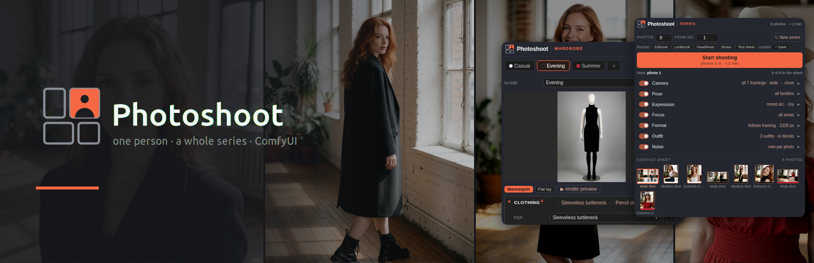
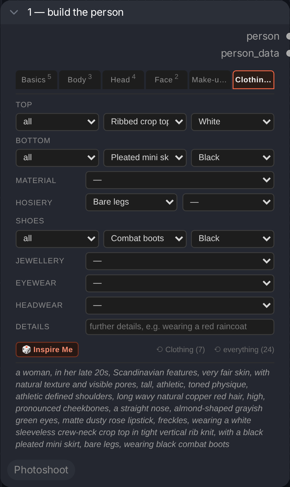
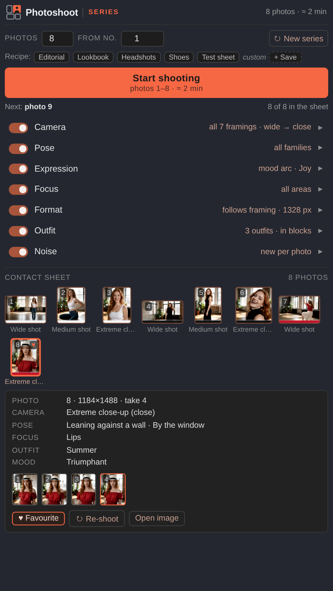

# Photoshoot



**You built a person. Now shoot 40 photos of her.**

Photoshoot is a set of ComfyUI nodes in two halves. The **Person Builder** describes
someone across 44 fields — body, face, hair, make-up, clothing — and saves them
under a name. The **Photoshoot** turns that person into a whole series: every
photo a different framing, pose, placement, expression and aspect ratio, while
the person stays the same. Set the count, press the button, and the node queues
all 40 runs itself.


## Building a person

44 fields across six tabs. You pick labels; the node writes English. Related fields
share a row — hair and its colour, eye shape and eye colour, lips and finish —
because they are merged into one phrase and you need to see both while setting
either.

A person with nineteen fields set:

```text
Basics    Woman · Late 20s · Scandinavian · Very fair · Natural pores
Body      Tall · Athletic · Athletic shoulders
Head      Long waves + Copper red · Almond-shaped + Greyish green
Face      High, pronounced cheekbones · Straight nose
Make-up   Dusty rose + Matte · Freckles
Clothing  Bare legs · Combat boots + Black
Details   wearing a charcoal wool coat
```

That produces one string, and the eye shape and colour have become a single
phrase rather than two competing ones:

```text
a woman, in her late 20s, Scandinavian features, very fair skin, with natural
texture and visible pores, tall, athletic, toned physique, athletic defined
shoulders, long wavy copper red hair, high, pronounced cheekbones, a straight
nose, almond-shaped grayish green eyes, matte dusty rose lipstick, freckles,
wearing a charcoal wool coat, bare legs, wearing black combat boots
```

The same person seen from further away — this is what the Photoshoot sends for a
full-body shot, and for a wide one:

```text
[figure]    … long wavy copper red hair, almond-shaped grayish green eyes,
            freckles, wearing a charcoal wool coat, bare legs, black combat boots
            (cheekbones, nose and lipstick dropped — 303 chars instead of 376)

[identity]  … long wavy copper red hair, grayish green eyes, freckles,
            wearing a charcoal wool coat, bare legs, black combat boots
            (eye shape and shoulders dropped too — 261 chars)
```

Nothing is lost: the builder keeps all nineteen fields and still shows them. Only
what gets sent shrinks with distance, because tokens the camera cannot resolve
still pull the composition onto the head.



*The Person Builder, Clothing tab. The superscripts count what is set on each
tab; hosiery and shoes carry their colour as a separate field on the same row;
the reset buttons name what they would clear. The composed English sentence sits
at the bottom and updates as you click.*

## The photoshoot

Six axes. Each can be switched off — then it holds still — or restricted to a
family: *only standing poses*, *only calm moods*, *only close-ups*.

| Axis | What varies |
|---|---|
| **Camera** | 7 framings, extreme close-up through wide shot |
| **Pose** | 18 postures in 4 families, plus placement in the room, orientation, arms, legs, tension — placement is coupled to the framing and tension to the posture, so no photo asks for a figure that is leaning against a wall and curled up at once |
| **Expression** | 90 moods in 9 families, plus eyes, gaze, mouth, brows, head tilt |
| **Focus** | 12 focal points, face to feet — coupled to the framing, since a wide shot does not focus on the lips |
| **Ratio** | 9 aspect ratios at a constant pixel count, coupled to the framing so a full-body shot never lands in 16:9 landscape |
| **Noise** | a fresh seed per photo, or one seed for the whole series to keep the setting recognisable |



Two things make this a series rather than 40 random images.

**It counts, it does not roll dice.** Run 7 always produces the same photo, so a
series is reproducible and you can extend it later. Counting uses a Kronecker
sequence — each field steps by the fractional part of a different square root —
because plain integer factors made fields with related list lengths march in
lockstep: the same body turn kept arriving with the same mouth.

**The person shrinks with distance.** The prompt for a wide shot drops lipstick,
eyeliner and brow shape and keeps the silhouette. Those tokens are invisible at
that range but still pull the composition back onto the head.
[More on that](docs/nodes.md#framing-wins-over-description).

## What a series looks like


Eight runs of one series, unretouched. Same person throughout — the hair, the
freckles, the charcoal coat and the black boots come from the Person Builder and
do not drift. What changes is the framing, the pose, where she stands in the
room, the expression and the aspect ratio; the two wide shots are landscape
because the framing chose the ratio.

You set the count — the default is twelve, 40 is as easy. The person is fixed;
everything else moves. This is the node's own preview of the first eight runs:

```text
 1  Extreme close-up → Eyes      Standing                Foreground              Neutral      1328×1328 [full]
 2  Portrait         → Face      Squatting               Foreground              Calculating  1152×1536 [full]
 3  Full body        → Legs      Sitting on a table edge In a doorway            Skeptical     992×1776 [figure]
 4  Close-up         → Neckline  Walking                 By the window           Gentle smile 1184×1488 [full]
 5  Cowboy shot      → Waist     Lying on the stomach    Moving through the room Defiant      1088×1632 [figure]
 6  Extreme close-up → Lips      Kneeling                Foreground              Frightened   1328×1328 [full]
 7  Medium shot      → Back      Sitting on a stool      By the window           Mischievous  1088×1632 [figure]
 8  Wide shot        → Back      Leaning against a wall  Against the far wall    Seductive    1328×1328 [identity]
```

Every run is a plain prompt. Photo 1 comes out as:

```text
extreme close-up shot, with the focus on the eyes, a sunlit loft with tall
windows, a woman, in her late 20s, Eastern European features, fair skin, tall,
hourglass figure, long wavy dark brown hair, almond-shaped green eyes, matte red
lipstick, wearing black opaque pantyhose, wearing black stiletto high heels,
standing, placed in the foreground, facing the camera directly, both arms held
behind the back, hands clasped together, legs closed together, with an upright
posture, a neutral expression, wide open eyes, looking directly at the camera,
relaxed brows, lips closed, head held straight, editorial photography, 85mm
```

The `[full]` / `[figure]` / `[identity]` tag is that detail level — compare
photo 1 with photo 8 and the lipstick is gone.

## The same person, or two sisters?

44 attributes describe a **type**, not an identity. *Scandinavian, late 20s,
long copper waves, a straight nose, greyish green almond eyes* — run that twice
and you get two women who could be sisters, because English has no word for eye
spacing, nose bridge width or jaw angle. That is not a gap in the field list. It
is a gap in the language, and no forty-fifth field closes it.

A reference image does. **Photoshoot Identity** stores images of a person under
her name in `ComfyUI/user/krea2_person_refs/` and hands them back as an `IMAGE`
batch plus a strength — which you wire into whatever face adapter you already
have: InstantID, PuLID, IP-Adapter FaceID, InfiniteYou, Qwen-Image-Edit,
Flux Kontext or Redux, ReActor. This pack ships none of them and adds no
dependencies; it emits pixels and a number, the same way it emits text.

**The attributes are not made obsolete by this.** They are the casting step —
they invent someone who does not exist yet. The reference is the anchoring step,
and it carries the **face** and nothing else. Hair length, figure, the charcoal
coat and the black boots still come out of the person block, and so does
everything the series varies. Cast first, then anchor.

**The strength follows the framing.** A face adapter at full weight on a wide
shot has forty pixels of head to work with. It cannot put a face in there, but
it still pulls: it fights the framing and drags the head back up in size — the
exact failure the detail levels were built to avoid. So the strength runs from
full on an extreme close-up down to the far value on a wide shot, along the same
seven framings:

```text
Detail 1.00 · Close-up 0.90 · Portrait 0.80 · Medium 0.60
Cowboy 0.45 · Full body 0.30 · Wide 0.00
```

Those are positions between your two widgets, not weights — every adapter reads
its weight on a different scale, so you set the height of the curve and the node
keeps the shape. Where the adapter goes quiet, the `[identity]` person block is
already carrying the series on its own.

**The hero shot.** You do not need a photo to start with. Run the series once on
the attributes alone, pick the frame where she looks right, and feed it back
through **Photoshoot Identity Save** with *only when empty* on: the first run
seeds the identity, every later run consumes it. Details in
[the node reference](docs/nodes.md#reference-images).

## Wiring

```text
Person Builder ──person_data──► Photoshoot ──┬── person   ─┐
  44 fields, saved once          the series  ├── pose      │
                                             ├── expression├──► Build Prompt ──► your sampler
                                             ├── camera    │
Scene / Style ───────────────────────────────┴── width/height/seed
```

1. **Build a person.** 44 fields across six tabs. Save under a name and reuse
   across sessions — the point is that the same person comes back.
2. **Send them to a photoshoot.** Set the count, restrict the axes you care
   about, press the button.
3. **Assemble the prompt.** Placeholders (`{camera}`, `{person}`, `{pose}` …)
   drop the parts into your own text, or the node appends them in a sensible
   order if you have none.

Pose and expression also work as standalone nodes when you do not want a series.

## Example workflow

[`example_workflows/photoshoot-series.json`](example_workflows/photoshoot-series.json)
is the whole thing wired up — drag it onto the ComfyUI canvas.

It contains the three Photoshoot nodes above, a scene and a style field, and a
two-pass sampler: 8 steps at full denoise, a 1.5× latent upscale, then 4 steps
at denoise 0.44. The second pass is not optional — without it an image takes
11.4 s instead of 24.8 s but comes out unusably soft, because latent upscaling
invents no detail.

`width` and `height` come from the Photoshoot node, so the aspect ratio follows
the framing. `bildseed` feeds both samplers, which is what makes a run
reproducible.

The three loaders name the files [Comfy-Org publishes for Krea
2](https://huggingface.co/Comfy-Org/Krea-2) — `krea2_turbo_fp8_scaled`,
`qwen3vl_4b_fp8_scaled` as CLIP type `krea2`, and `qwen_image_vae` — so the
example matches what you already have if you followed the official ComfyUI
tutorial. If yours are named differently, ComfyUI flags the loader nodes on load
and you pick your own; the rest of the graph is unaffected.

The text encoder is the one part that is not interchangeable. Krea 2 taps twelve
layers of Qwen3-VL-4B at a hidden size of 2560, so plain Qwen3-4B (no vision
tower) and the 32B build (wrong width) will not load.

After changing anything under `js/`, bump the version in `pyproject.toml` and
run `python3 tools/setze_js_version.py`. ComfyUI serves the `.mjs` files without
a Cache-Control header, so without a fresh `?v=` in the import a browser can sit
on the old interface for a day or more.

The workflow is generated by `tools/baue_workflow.py`, which checks every node
type, input name, output index and required input against a running ComfyUI. It
was verified by actually executing it, not just by loading it.

## Which models does this work with?

Any of them, in principle. The nodes emit **text** — the person, the pose, the
expression, the camera phrasing — plus width, height and a seed. Nothing here
touches a model, so whatever consumes a prompt can consume these.

What differs is how much of it survives:

- **Models with a T5 or LLM text encoder** — Flux, SD 3.5, Qwen-Image, Krea 2 —
  are the good case. A finished prompt here runs 620 to 770 characters, roughly
  150–190 tokens, and these read all of it as connected language. The whole
  design assumes this: that "arms behind the back, hands clasped together"
  lands as a sentence rather than as loose keywords.
- **CLIP-only models** — SD 1.5, SDXL — cap out at 77 tokens per chunk. The
  prompt still works, but it gets split, and details near the end lose weight.
  Set fewer fields, and use the detail levels: a wide shot already sends a much
  shorter person block.
- **Edge lengths** run 1024 to 1536, sized for current models. For SD 1.5 at
  512 they are too large; the ratio coupling still helps, the pixel counts do
  not.

Krea 2 is what the [measurements](docs/measurements.md) were taken against and
what the example workflow loads — that is the extent of the tie.

## Installation

No dependencies beyond ComfyUI itself.

Through **ComfyUI Manager**: search for *Photoshoot* and install. Or by hand:

```bash
cd ComfyUI/custom_nodes
git clone https://github.com/ralksta/ComfyUI-Photoshoot
```

Restart ComfyUI afterwards; the nodes appear under the **Photoshoot** category.

The interface follows ComfyUI's language setting: German if ComfyUI is set to
German, English otherwise. Note that ComfyUI defaults to your **browser
language** when you have never picked one, so a German browser gives you a
German interface without you setting anything. Pick a language explicitly under
Settings → Comfy → Locale. The prompt is identical either way — see
[Language](docs/internals.md#language).

## The nodes

| Node | What it does |
|---|---|
| **Photoshoot Person** | 44 fields on six tabs; outputs the person as text and as JSON |
| **Photoshoot Series** | the series: six axes, queues the runs itself |
| **Photoshoot Pose** | posture, placement, orientation, arms, legs, tension |
| **Photoshoot Expression** | 90 moods in nine families, plus eyes, gaze, mouth, brows, head |
| **Photoshoot Build Prompt** | drops the parts into your prompt text |
| **Save / Load** | persons, scenes, styles and prompts under `ComfyUI/user/krea2_*` |
| **Photoshoot Pick Blocks** | four dropdowns, four outputs in one node |
| **Photoshoot Identity Save** | stores reference images of a person, up to eight |
| **Photoshoot Identity** | hands them back as a batch, plus a strength that follows the framing |

[**Full reference →**](docs/nodes.md) — every control, and why the awkward ones
are the way they are: how focus is coupled to framing, why the person block
shrinks with distance, how the series counts without repeating itself.

## More

- [Internals](docs/internals.md) — layout, translation, tests, which ComfyUI
  versions this was built against
- [Measurements](docs/measurements.md) — what actually got measured, including
  a conclusion that turned out to be wrong
- [Changelog](CHANGELOG.md)

## Saved blocks

The stores live under `ComfyUI/user/krea2_*` and are **not** part of this
repository — that is where personal content ends up. If you want them backed up,
copy those folders deliberately.

## Scope

Photoshoot describes adult subjects. The age presets start at the early 20s,
and the exact-age field has a floor of 18 — type a lower number and both the
preview and the prompt say 18.

That floor is a guardrail against the accident, not a content filter. These
nodes only emit text, and text can be typed into any node.

## License

MIT — see [LICENSE](LICENSE).
