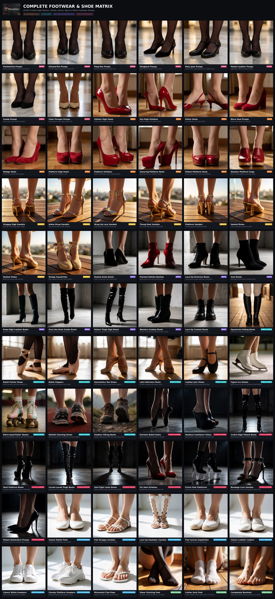
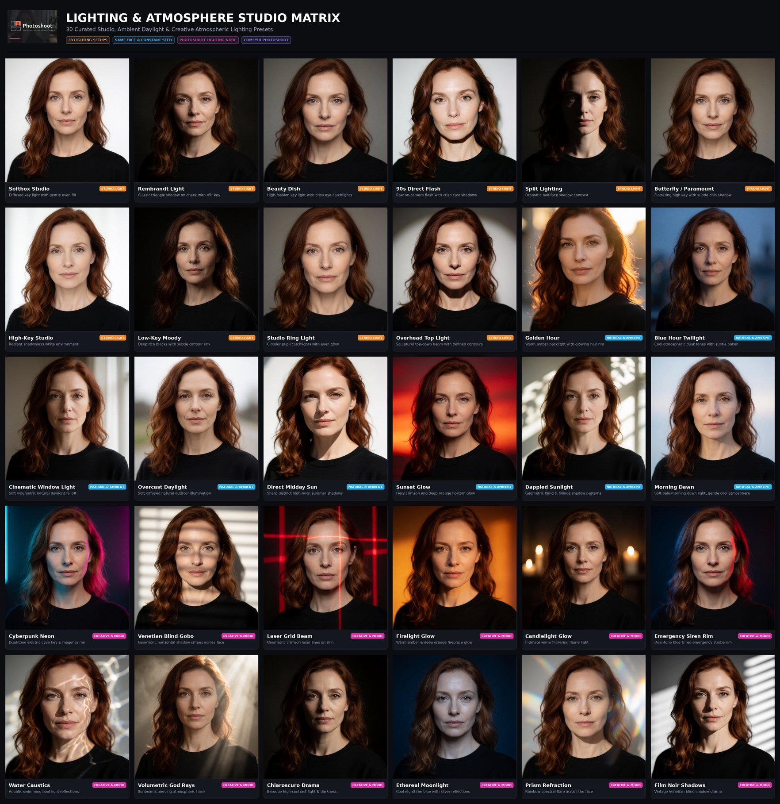
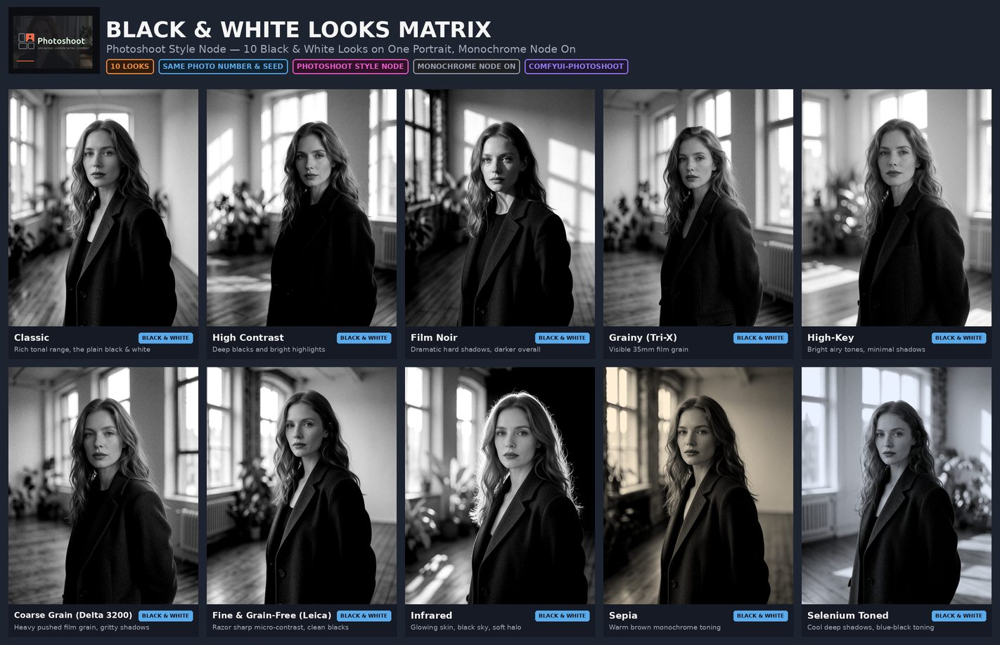
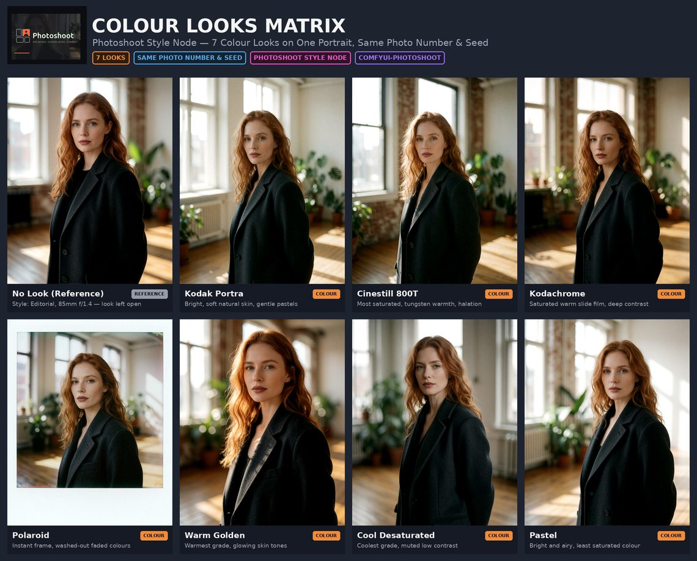
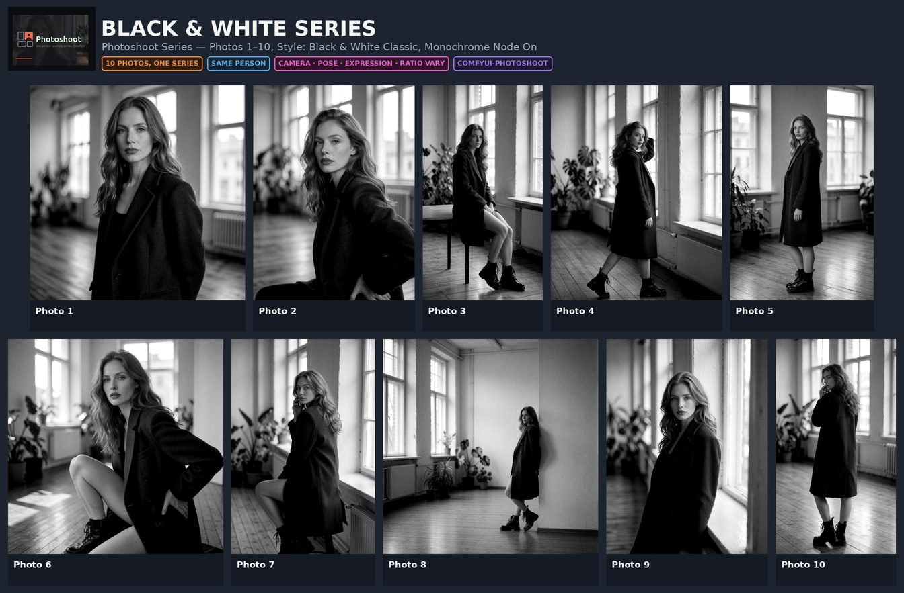
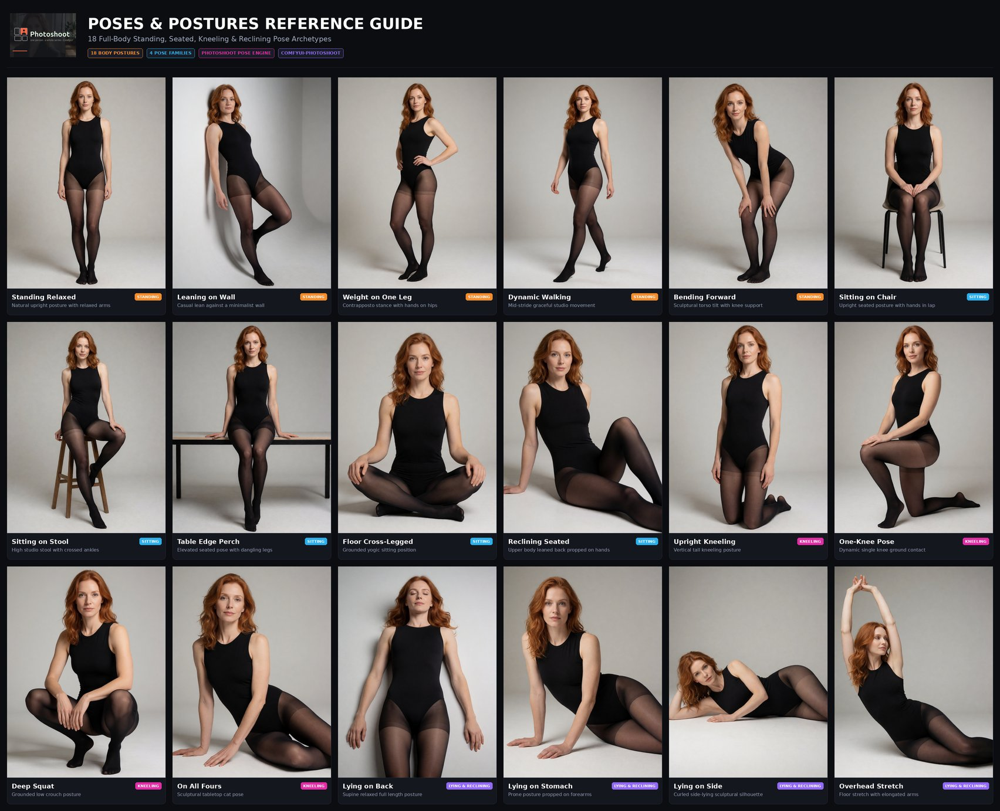
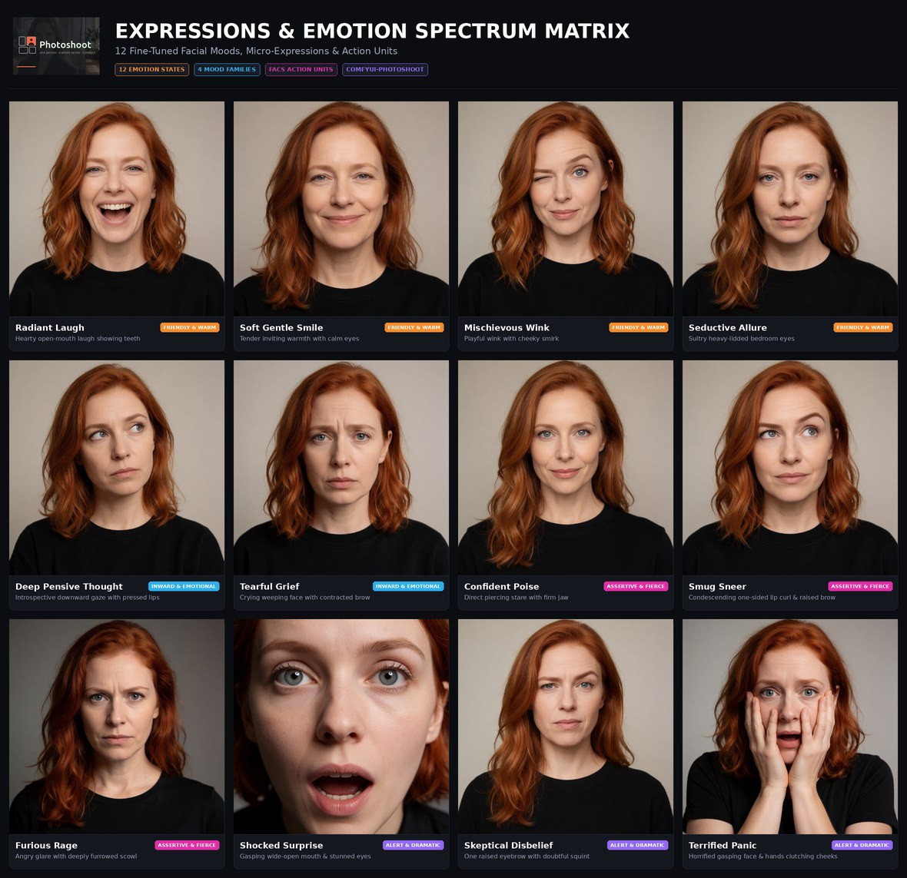

# Visual Reference Posters & Style Matrices

Visual contact sheets and style matrices generated directly with **ComfyUI-Photoshoot** prompt configurations.

> [!NOTE]
> **About Model Outputs & Prompt Engine**  
> *ComfyUI-Photoshoot builds precision English prompt strings and camera framings. The visual output naturally depends on your active diffusion model, checkpoint, LoRAs, resolution, and sampler settings.*  
> *The reference matrices below were rendered using pure text prompts on **Krea2 Turbo (fp8 scaled)** with **Qwen-VL** (8 steps, CFG 1.0, 0 LoRAs).*

---

##  Complete Footwear & Shoe Matrix (66 Models)

A visual catalogue of all 66 built-in footwear presets across 8 families, demonstrating isolated macro floor-level perspectives and material finishes.

*(Click image to open full-resolution 3400×7500 master poster)*

### Categories & Presets Overview

| Category | Presets & Styles |
|---|---|
| **Pumps** | *Pointed-Toe Pumps, Almond-Toe Pumps, Peep-Toe Pumps, Slingback Pumps, Mary Jane Pumps, Patent Leather Pumps, Suede Pumps, Clear Perspex Pumps* |
| **Heels** | *Stiletto High Heels, Sky-High Stilettos, Kitten Heels, Block Heel Pumps, Wedge Heels, Platform High Heels, Platform Stilettos, Towering Platform Heels, Patent Platform Heels, Wooden Platform Clogs* |
| **Sandals** | *Strappy High Sandals, Ankle-Strap Sandals, Wrap-Up Lace Sandals, Thong Heel Sandals, Platform Sandals, Heeled Mules, Heeled Slides, Wedge Espadrilles* |
| **Boots** | *Heeled Ankle Boots, Pointed Stiletto Booties, Lace-Up Victorian Boots, Sock Boots, Knee-High Leather Boots, Over-the-Knee Suede Boots, Patent Thigh-High Boots, Western Cowboy Boots, Lace-Up Combat Boots* |
| **Dance & Sport** | *Equestrian Riding Boots, Ballet Pointe Shoes, Ballet Slippers, Gymnastics Toe Shoes, Latin Ballroom Heels, Leather Jazz Shoes, Figure Ice Skates, Retro Quad Roller Skates, Athletic Running Shoes, Outdoor Hiking Boots* |
| **Fetish & Extreme** | *Extreme Ballet Heels, Heelless Cantilever Shoes, Crotch-High Patent Boots, Hoof Platform Boots, Corset-Laced Thigh Boots, Skin-Tight Latex Boots, Pin Heel Stilettos, 8-Inch Pole Platforms, Bondage Lock Sandals, Patent Dominatrix Pumps* |
| **Flats & Sneakers** | *Classic Ballet Flats, Flat Strappy Sandals, Lace-Up Gladiator Sandals, Flat Canvas Espadrilles, Classic Leather Loafers, Classic White Sneakers, Chunky Platform Sneakers, Minimalist Flip-Flops* |
| **Bare & Socks** | *Sheer Stocking Feet (15 denier), Cotton Sock Feet, Completely Barefoot* |

---

## Lighting & Atmosphere Studio Matrix (30 Setups)

A visual studio contact sheet showcasing 30 curated lighting styles, gobos, daylight conditions, and dramatic atmospheric presets on a constant character identity and seed.

*(Click image to open full-resolution 3400×3650 master poster)*

### Categories & Presets Overview

| Category | Presets & Styles |
|---|---|
| **Studio Light** | *Softbox Studio, Rembrandt Light, Beauty Dish, 90s Direct Flash, Split Lighting, Butterfly / Paramount, High-Key Studio, Low-Key Moody, Studio Ring Light, Overhead Top Light* |
| **Natural & Ambient** | *Golden Hour, Blue Hour Twilight, Cinematic Window Light, Overcast Daylight, Direct Midday Sun, Sunset Glow, Dappled Sunlight, Morning Dawn* |
| **Creative & Mood** | *Cyberpunk Neon, Venetian Blind Gobo, Laser Grid Beam, Firelight Glow, Candlelight Glow, Emergency Siren Rim, Water Caustics, Volumetric God Rays, Chiaroscuro Drama, Ethereal Moonlight, Prism Refraction, Film Noir Shadows* |

---

## Black & White Looks Matrix (10 Looks)

The black & white family of the **Photoshoot Style** node on one portrait: same photo number, same seed, same person, only the look changes, Monochrome node switched on. Eighteen wordings were tried; these ten are the ones that measurably differ. Famous film stocks are in here as what they look like, not by name — "shot on Ilford Delta 3200" rendered like plain black and white, "extremely grainy black and white photograph" did not. Numbers in [measurements](measurements.md).

*(Click image to open full-resolution 2844×1836 master poster)*

| Category | Looks |
|---|---|
| **Black & White** | *Classic, High Contrast, Film Noir, Grainy (Tri-X), High-Key, Coarse Grain (Delta 3200), Fine & Grain-Free (Leica), Infrared, Sepia, Selenium Toned* |

---

## Colour Looks Matrix (7 Looks)

The colour family on the same portrait, first tile without a look for reference. Sixteen wordings were tried; teal & orange, cross-processed, Lomo, bleach bypass and the like rendered as the reference image and were dropped. These seven move brightness, saturation or warmth by a measurable margin.

*(Click image to open full-resolution 2280×1836 master poster)*

| Category | Looks |
|---|---|
| **Colour** | *Kodak Portra, Cinestill 800T, Kodachrome, Polaroid, Warm Golden, Cool Desaturated, Pastel* |
| **Also on the node** | *Genre (13), Lens (10), Finish (8), free text — and a die per field* |

---

## Black & White Series (10 Photos)

Ten photos of one series, unretouched: Style *Black & White Classic*, Monochrome node on. The person stays, camera, pose, expression and aspect ratio vary — the ratio follows the framing, which is why the wide shots are square and the portraits tall.

*(Click image to open full-resolution 2688×1766 master poster)*

---

## Hairstyles & Hair Colors Matrix (20 Presets & Trend Colors)

A visual catalogue showcasing all 20 built-in hairstyle cuts, volumes, and silhouettes paired with curated natural and vibrant fashion hair colors.

*(Click image to open full-resolution 2900×2900 master poster)*

### Categories & Presets Overview

| Category | Hairstyle & Color Presets |
|---|---|
| **Long & Textured** | *Long Straight (Platinum Blonde), Long Waves (Copper Red), Voluminous Curls (Honey Blonde), Textured Afro (Deep Black), Long Box Braids (Jet Black)* |
| **Medium & Layered** | *Classic Bob (Dark Brown), Straight Bangs (Chocolate Brown), Curtain Bangs (Golden Blonde), Layered Wolf Cut (Pastel Pink), Sleek Wet-Look (Midnight Blue)* |
| **Updos & Modern** | *High Ponytail (Dark Blonde), Messy Bun (Auburn), Side Braid (Strawberry Blonde), Half-Up Style (Caramel Brown), Space Buns (Emerald Green)* |
| **Short & Edgy** | *Sleek Low Bun (Black), Pixie Cut (Espresso), Short Tousled (Silver Gray), Buzzcut (Icy Platinum), Edgy Undercut (Rich Copper)* |

---

## Poses & Postures Reference Guide (18 Full-Body Postures)

A visual studio reference sheet demonstrating all 18 standing, seated, kneeling, and reclining pose archetypes rendered in full-body perspective.

*(Click image to open full-resolution 3300×2700 master poster)*

### Categories & Presets Overview

| Category | Pose Archetypes |
|---|---|
| **Standing** | *Standing Relaxed, Leaning on Wall, Weight on One Leg (Contrapposto), Dynamic Walking, Bending Forward* |
| **Sitting** | *Sitting on Chair, Sitting on Stool, Table Edge Perch, Floor Cross-Legged, Reclining Seated* |
| **Kneeling** | *Upright Kneeling, One-Knee Pose, Deep Squat, On All Fours (Cat Pose)* |
| **Lying & Reclining** | *Lying on Back, Lying on Stomach, Lying on Side, Overhead Stretch* |

---

## Expressions & Emotion Spectrum (12 Facial Moods)

A visual facial reference matrix showcasing 12 distinct high-contrast emotion states, micro-expressions, gaze angles, and brow/mouth variations across 4 mood families.

*(Click image to open full-resolution master poster)*

### Categories & Presets Overview

| Category | Emotion States & Micro-Expressions |
|---|---|
| **Friendly & Warm** | *Radiant Laugh, Soft Gentle Smile, Mischievous Wink, Seductive Allure* |
| **Inward & Assertive** | *Deep Pensive Thought, Tearful Grief, Confident Poise, Smug Sneer* |
| **Alert & Dramatic** | *Furious Rage, Shocked Surprise, Skeptical Disbelief, Terrified Panic* |

*For prompt engineering principles and FACS Action Unit mechanics, see the [How-To & Prompt Engineering Guide](GUIDE.md).*
