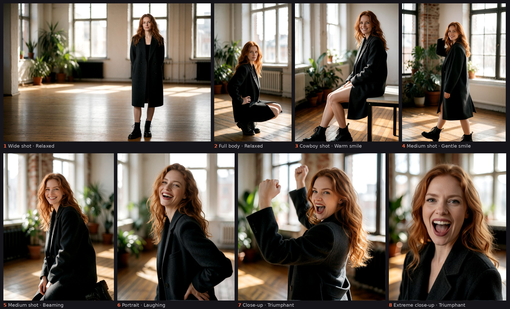

# Quickstart

From an empty canvas to a finished series in six steps. Everything here uses
the example workflow, so nothing has to be wired by hand; the
[README](../README.md) and the [node reference](nodes.md) explain what each
control does and why.

## 1. Install and get the models

Install *Photoshoot* through ComfyUI Manager, or clone it into
`ComfyUI/custom_nodes` and restart ComfyUI. There are no dependencies beyond
ComfyUI.

The example workflow loads the three files [Comfy-Org publishes for Krea
2](https://huggingface.co/Comfy-Org/Krea-2): `krea2_turbo_fp8_scaled`,
`qwen3vl_4b_fp8_scaled` (CLIP type `krea2`) and `qwen_image_vae`. Other
models work too, since the nodes only write text; pick your own files in the
three loaders on the left.

## 2. Load the example workflow

Open ComfyUI's template browser and pick the series workflow under
**ComfyUI-Photoshoot**, or drag
[`example_workflows/photoshoot-series.json`](../example_workflows/photoshoot-series.json)
onto the canvas. Short notes in the graph say what each group is for.

It comes with a filled-in person, a scene, light, style and a two-pass
sampler. You could press **Start shooting** right away; the next two steps
make it your person.

## 3. Build the person and dress her

The **Person Builder** is a profile sheet of five sections: basics, body,
head, face, make-up. Click a row to open it, pick labels, and the node writes
the English prompt. Long lists open under their row: type to search, by
German or English name or by prompt text, and clothes, shoes and hats show a
picture of the entry under the pointer on a neutral mannequin.

Clothes live in the **Wardrobe** next to it, one outfit per tab. The person
wears the open tab; in a series she changes through all of them.

- **Have a character LoRA?** Put its trigger into *LoRA trigger* under
  Basics. Face, hair and make-up then come from the LoRA, and the person only
  adds age, body and outfit. Load the LoRA itself in the workflow as usual.
- **Want to keep her?** The builder's fields are stored in the workflow, so
  save the workflow (`Ctrl+S`) and she comes back with it. *Photoshoot – Save
  Person* on the `person` output keeps the finished text under a name in
  `ComfyUI/user/krea2_persons/`, for other workflows.

Then set the scene (the text field), **Lighting** and **Style** in the middle
of the graph. They stay the same for the whole series.

## 4. Draft a test sheet

Before a long series, check the person on a few cheap images:

1. In the Series node, click the recipe **Test sheet**: seven photos, every
   framing once.
2. Select `LatentUpscaleBy` and the second `KSampler` and press `Ctrl+B`.
   That skips the refinement pass: about half the time per image, at the base
   resolution.
3. Press **Start shooting** in the node's panel.

Does the face hold from wide shot to close-up? Is the outfit right? Change
what is off and shoot again. When it fits, press `Ctrl+B` on the two nodes
once more for full quality. Runs 1 to 7 of the draft are runs 1 to 7 of the
real series, since the series counts rather than rolls dice.

## 5. Shoot the series

1. Pick a recipe (*Editorial*, *Lookbook*, *Headshots*, *Shoes*), or open
   the axis rows and restrict what should vary: framing, pose, expression,
   outfit, focus, format, noise.
2. Set **photos** (the count). Try *wide → close* under Camera and a mood arc
   such as *Joy* under Expression for a series that tells something.
3. Press **Start shooting**. The node queues every run itself and shows how
   long that will take.

**Start shooting, not Queue.** The Queue button above the canvas renders one
photo, the one the panel calls *Next*. Images go to `output/photoshoot/`
(`series_00001_.png`, ...).

## 6. Pick from the contact sheet

Every photo appears in the node as a frame in its real aspect ratio, filled
once it is rendered. Click one for its framing, pose and mood; mark it as a
**favourite**, or mark it for a **re-shoot**: the same plan with new noise,
while the rest of the series stays. With *takes per photo* (under Noise) each
photo is rendered two to four times and you pick the take.

## Good to know

- **A new start number is a new series** with the same settings.
  *↻ New series* draws one; type an old number back in and that series
  returns.
- **Black and white?** Pick it under *Look* in the Style node, then enable
  *Photoshoot – Monochrome* before Save Image (`Ctrl+B`). Keep `{style}` first
  in the prompt template.
- **Need the same face across images** for a reference or a LoRA training set?
  Load [`photoshoot-anchor-set.json`](../example_workflows/photoshoot-anchor-set.json)
  instead; the README explains [why the noise axis goes off
  first](../README.md#need-a-character-to-use-elsewhere).
- **Already have your character** from a LoRA or IPAdapter? Unwire the Person
  Builder; the series still varies everything around her
  ([more](../README.md#already-have-your-character)).
- **Missing a hat, a cut or a light setup?** Add your own entries from a JSON
  file, which any chat LLM can write for you
  ([how](nodes.md#custom-entries)).
